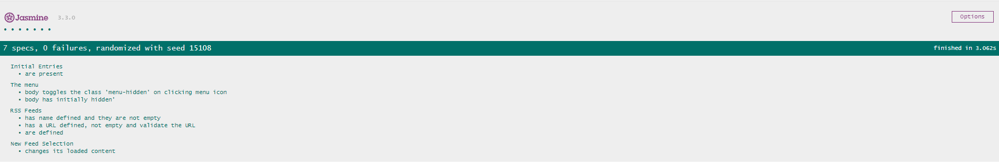

# Project Overview

The project reads RSS Feeds. [Jasmine](https://jasmine.github.io/) is used to test the project. 

## Why this Project?

Testing is an important part of the development process and many organizations practice a standard of development known as "test-driven development." This is when developers write tests first, before they ever start developing their application. All the tests initially fail and then they start writing application code to make these tests pass.

Whether you work in an organization that uses test-driven development or in an organization that uses tests to make sure future feature development doesn't break existing features, it's an important skill to have!

## How to run?

1. Download the `ZIP` file
or clone the project `git clone https://github.com/khaled-ansary/FeedReader-JS-Testing.git`
2. Open the index.html file

## Live Version
You can find a live version of the project [here](https://khaled-ansary.github.io/FeedReader-JS-Testing/)

## Screenshot

## Dependencies

* [Jasmine](https://jasmine.github.io/)
* 
### License

The MIT License

Copyright (c) Md Khaled Hossain Ansary

[License](LICENSE.md)